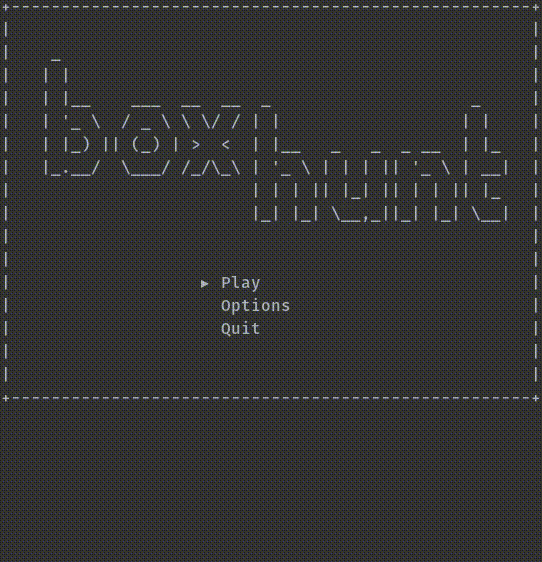

# box-hunt
A fun terminal game based on Duck Hunt.

# Features
- Amazing graphics
- Engaging audio
- Addicting gameplay

# How to Play
Make sure dependencies (ncursesw, SDL2, SDL2_mixer) are installed.

Compile with `make build` and play with `./run`.

# Credits
Audio - Juhani Junkala, KSHMR

Everything else - Zachary Huang
